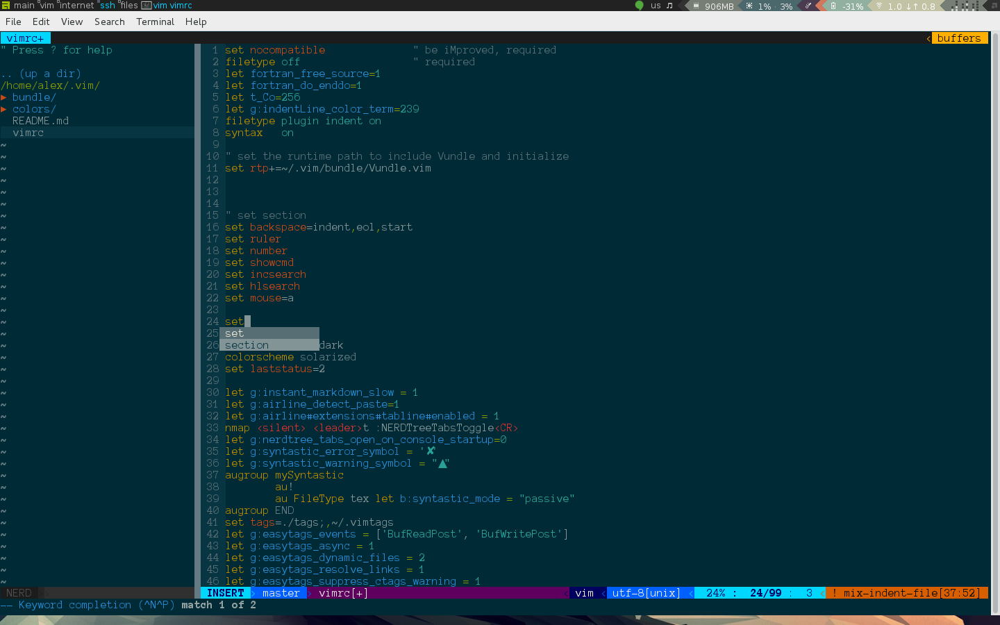

iDeVim
----

Configuration for vim improving user experience.



Contains next plugins:
- look and feel
    - Plugin ['altercation/vim-colors-solarized'](https://github.com/altercation/vim-colors-solarized)
         -- This color sheme work only if terminal emulator support 256 colors. For details see autorhs git page.
    - Plugin ['tomasr/molokai'](https://github.com/tomasr/molokai)
         -- Molokai is a Vim port of the monokai theme for TextMate originally created by Wimer Hazenberg. Support all terminal emulators.
    - Plugin ['bling/vim-airline'](https://github.com/vim-airline/vim-airline)
         --  Powefull status line for vim.
-  plushki :)
    - Plugin ['scrooloose/nerdtree'](https://github.com/scrooloose/nerdtree)
         -- File explorer for vim. Open by Ctrl-n if you not in INSERT mode.
    - Plugin ['scrooloose/syntastic'](https://github.com/scrooloose/syntastic)
         -- Syntastic is a syntax checking plugin for Vim. Support a lot of languages.
    - Plugin ['xolox/vim-misc'](https://github.com/xolox/vim-misc)
         -- The vim-misc plug-in contains Vim scripts that are used by most of the Vim plug-ins I've written xolox.
    - Plugin ['jistr/vim-nerdtree-tabs'](https://github.com/jistr/vim-nerdtree-tabs)
         -- For NERDTree
    - Plugin ['xolox/vim-easytags'](https://github.com/xolox/vim-easytags)
         -- Automated tag generation and syntax highlighting in Vim. In Debian/Ubuntu need sudo exuberant-ctags (sudo apt-get install exuberant-ctags)
    - Plugin ['majutsushi/tagbar'](https://github.com/majutsushi/tagbar)
         -- Tagbar is a Vim plugin that provides an easy way to browse the tags of the current file and get an overview of its structure. F8 for show tagbar.
    - Plugin ['kien/ctrlp.vim'](https://github.com/kien/ctrlp.vim)
         -- Full path fuzzy file, buffer, mru, tag, ... finder for Vim. Next version must using [https://github.com/ctrlpvim/ctrlp.vim](https://github.com/ctrlpvim/ctrlp.vim)
    - Plugin ['vim-scripts/a.vim'](https://github.com/vim-scripts/a.vim)
         -- For Clang`s, switch betwen header and source for example foo.h and foo.c
-  git
    - Plugin ['airblade/vim-gitgutter'](https://github.com/airblade/vim-gitgutter)
         -- A Vim plugin which shows a git diff in the 'gutter' (sign column). It shows whether each line has been added, modified, and where lines have been removed. You can also stage and undo individual hunks.
    - Plugin ['tpope/vim-fugitive'](https://github.com/tpope/vim-fugitive)
         -- Git wrapper
- for man and tmux
    - Plugin ['christoomey/vim-tmux-navigator'](https://nodejs.org/)
         -- Vim Tmux Navigator (If you using tmux)
    - Plugin ['jez/vim-superman'](https://github.com/jez/vim-superman)
         -- This is a simple Vim plugin and sh function that makes replacing man from the command line a cinch.
- better editung
    - Plugin ['Raimondi/delimitMate'](https://github.com/Raimondi/delimitMate)
         -- Vim plugin, provides insert mode auto-completion for quotes, parens, brackets, etc. 
    - Plugin ['Yggdroot/indentLine'](https://github.com/Yggdroot/indentLine)
         -- This plugin is used for displaying thin vertical lines at each indentation level for code indented with spaces.
- syntax
    - Plugin ['jez/vim-c0'](https://github.com/cmugpi/vim-c0)
         -- A Vim plugin for getting C0 syntax highlighting in Vim.
    - Plugin ['jez/vim-ispc'](https://github.com/jez/vim-ispc)
         -- Syntax highlighting for ISPC, packaged up as a Pathogen/Vundle plugin.
    - Plugin ['kchmck/vim-coffee-script'](https://github.com/kchmck/vim-coffee-script)
         -- This project adds CoffeeScript support to vim. It covers syntax, indenting, compiling, and more.

### Installation

For install just clone git into ~/.vim, rename vimrc to .vimrc and move him to you home folder.  
```sh
git clone https://github.com/0x0BSoD/ideVim.git ~/.vim/ && mv ~/.vim/vimrc ~/.vimrc
```
License
----

MIT


**Free Software, Hell Yeah!**

